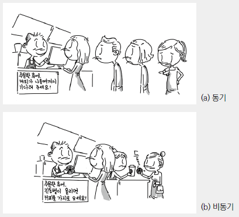

---

title: 동기 vs 비동기
categories: [운영체제, 동기와 비동기]
tags: [동기,비동기]     # TAG names should always be lowercase
author:
  name: Choi Jin Kyu
  link: https://github.com/hmcck27
toc: true

img_path: /assets/img/mdImage/

---


# Synchronous vs Asynchronous

> 데이터를 어떻게 처리할까 ?

동기, 비동기에 대해서 실제로 면접에서 질문을 받았었다.  
하지만 명확하게 대답하지 못해서 너무 아쉬워서 한번 정리해보고자 한다.  

동기, 비동기에 대해서 검색해보면 흔히 다음과 같은 예시를 본다.  

<!--  -->
  


동기는 한줄에 주루룩 사람들이 서서 업무를 처리하는 것을 말한다면,  
비동기는 여러 줄에서 동시에 사람들의 다른 업무를 처리한다.  

일단은 그림에서는 카페니까 어떤 방식이 효율적일까 ?  
당연히 비동기 방식 2번째 방식이 효율적이다.  
동기로 일하면 커피가 나오는데는 시간이 소모되고, 해당 시간동안 다른 업무를 처리하지 못한다.   


<!--  -->
{: w="500" }


클라이언트가 서버에게 요청을 보냈을때,  
동기라면 클라이언트는 서버가 응답을 내려줄 때까지 기다린다.  
비동기는 요청을 보내고 다른 작업을 하다가 응답이 내려오면 다시 기존 작업으로 돌아간다.  

---

### 동기 Synchronous

동기방식은 서버에서 요청을 보냈을 때 응답이 돌아와야 다음 동작을 수행할 수 있다.  
즉 A작업이 모두 진행 될때까지 B작업은 대기해야 한다.  

작업들은 마치 큐의 작동방식처럼 차례대로 들어가서 차례대로 처리된다.  

특정 하나의 작업이 실행중이면 다른 작업들은 대기하게 된다.  

### 비동기 Asynchronous

비동기 방식은 반대로 요청을 보냈을 때 응답과 상관없이 다음 동작을 수행 할 수 있다.  
즉 A작업이 시작하면 동시에 B작업이 실행된다.  
A작업은 결과값이 나오는대로 출력된다.  

작업들은 동시에 진행되는 듯하지만 실제로는  
쓰레드가 이리저리 작업하는 프로세스를 교체하면서 기다리는 시간은 줄인다.  

파이썬은 asyncio를 사용하고, 자바에서는 multi-thread를 활용한다.

---

일단은 왜 비동기를 사용해야 할까 ?

예를 들어서, 서버딴에서 여러 사이트를 스크래핑하고 싶다.  
이 사이트들은 무제한적으로 하나의 ip에서 많은 request를 보내도 block당하지 않는다.

그렇다면 우리는 어떤 로직으로 스크래핑을 해야할까 ?

우선은 동기적으로 request를 보내본다고 가정하자.  

동기적으로 진행한다면 웹사이트에서 응답을 내려주는 시간동안 서버는 놀게 된다.  

비동기적으로 진행한다면 웹사이트에서 응답을 내려주는 시간동안 기존 응답의 html을 파싱한다.  

즉 여러개의 작업을 순차적으로 진행하는 것보다 비동기로 휴식시간이 없게 진행해야지 효율적이다.  

```java
public class Async {

    public static void main(String[] args) {

        Thread req1 = new Thread(() -> {
            String res = req("www.mySite1.com");
            System.out.println("res = " + res);
        });
        Thread req2 = new Thread(() -> {
            String res = req("www.mySite2.com");
            System.out.println("res = " + res);
        });
        Thread req3 = new Thread(() -> {
            String res = req("www.mySite3.com");
            System.out.println("res = " + res);
        });
        Thread req4 = new Thread(() -> {
            String res = req("www.mySite4.com");
            System.out.println("res = " + res);
        });
        Thread req5 = new Thread(() -> {
            String res = req("www.mySite5.com");
            System.out.println("res = " + res);
        });

        req1.start();
        req2.start();
        req3.start();
        req4.start();
        req5.start();

    }

    public static String req(String url) {

        /**
         * 1. 요청을 보내고
         * 2. html을 파싱하고
         * 3. 데이터를 정제해서 리턴하는 과정
         */

        return new String(url + " 을 처리 완료했습니다.");

    }
}
```

해당 코드는 5개의 쓰레드를 만들어서 각 사이트를 총 다섯번 스크래핑했다.  
동기적으로 작동한다면 당연히 순차적으로 사이트1부터 사이트5까지 스크래핑할것이다.  

JAVA의 Multi-thread는 각 쓰레드의 실행을 비동기로 처리하기 때문에  
결과는 다음과 같다.  

<!--    -->
  

순차적으로 처리가 되지 않았다.  
물론 이건 자바의 스케쥴러가 처리 순서를 결정하기 때문에  
실행하는 환경, 시간에 따라서 결과가 다르다.  

그렇다면 시간 차이는 어느정도 걸릴까 ?  

```java

// 비동기

public class Async {

    public static void main(String[] args) {

        Thread req1 = new Thread(() -> {
            String res = null;
            try {
                res = req("www.mySite1.com");
            } catch (InterruptedException e) {
                e.printStackTrace();
            }
            System.out.println("res = " + res);
        });
        Thread req2 = new Thread(() -> {
            String res = null;
            try {
                res = req("www.mySite2.com");
            } catch (InterruptedException e) {
                e.printStackTrace();
            }
            System.out.println("res = " + res);
        });
        Thread req3 = new Thread(() -> {
            String res = null;
            try {
                res = req("www.mySite3.com");
            } catch (InterruptedException e) {
                e.printStackTrace();
            }
            System.out.println("res = " + res);
        });
        Thread req4 = new Thread(() -> {
            String res = null;
            try {
                res = req("www.mySite4.com");
            } catch (InterruptedException e) {
                e.printStackTrace();
            }
            System.out.println("res = " + res);
        });
        Thread req5 = new Thread(() -> {
            String res = null;
            try {
                res = req("www.mySite5.com");
            } catch (InterruptedException e) {
                e.printStackTrace();
            }
            System.out.println("res = " + res);
        });

        long beforeTime = System.currentTimeMillis(); //코드 실행 전에 시간 받아오기

        req1.start();
        req2.start();
        req3.start();
        req4.start();
        req5.start();

        try{
            // 스레드 종료 대기
            req1.join();
            req2.join();
            req3.join();
            req4.join();
            req5.join();
        } catch (InterruptedException e) {
            e.printStackTrace();
        }

        long afterTime = System.currentTimeMillis(); // 코드 실행 후에 시간 받아오기
        long secDiffTime = (afterTime - beforeTime)/1000; //두 시간에 차 계산
        System.out.println("시간차이(m) : "+secDiffTime);

    }

    public static String req(String url) throws InterruptedException {

        /**
         * 1. 요청을 보내고
         * 2. html을 파싱하고
         * 3. 데이터를 정제해서 리턴하는 과정
         */

        Thread.sleep(2000);

        return new String(url + " 을 처리 완료했습니다.");

    }
}
```

해당 요청에 걸리는 시간은 다음과 같다.  
  

<!--    -->
  

   
동기로 보내면 어떨까?  

뭐 다 예상하겠지만 2초 걸리는걸 5번보냈으니 10초다.

```java
public class Sync {

    public static void main(String[] args) throws InterruptedException {

        long beforeTime = System.currentTimeMillis(); //코드 실행 전에 시간 받아오기

        String res1 = req("www.mySite1.com");
        System.out.println("res1 = " + res1);

        String res2 = req("www.mySite2.com");
        System.out.println("res2 = " + res2);

        String res3 = req("www.mySite3.com");
        System.out.println("res3 = " + res3);

        String res4 = req("www.mySite4.com");
        System.out.println("res4 = " + res4);

        String res5 = req("www.mySite5.com");
        System.out.println("res5 = " + res5);

        long afterTime = System.currentTimeMillis(); // 코드 실행 후에 시간 받아오기
        long secDiffTime = (afterTime - beforeTime)/1000; //두 시간에 차 계산
        System.out.println("시간차이(m) : "+secDiffTime);

    }

    public static String req(String url) throws InterruptedException {

        /**
         * 1. 요청을 보내고
         * 2. html을 파싱하고
         * 3. 데이터를 정제해서 리턴하는 과정
         */

        Thread.sleep(2000);

        return new String(url + " 을 처리 완료했습니다.");

    }
}
```

결과는 다음과 같다.

<!--      -->


---
## 정리

그렇다고 항상 비동기가 좋은건 아니다.  
1. 멀티 쓰레딩 환경에서는 쓰레드가 공유하는 변수를 바꾸거나 등등의 일이 있다면 원하는 결과를 못 얻을 수 있다.  
2. 디버깅이 힘들다. 비동기는 언제 해당 프로세스가 처리되는지 개발자가 알기가 힘들다.  
3. 설계가 복잡하다.

등의 문제가 있으니, 언제 비동기를 써야 할까 충분한 고민을 하고 사용해야 한다.  

나같은 경우에는 예전에 하던 서비스에서 pdf에 워터마크를 박는데 비동기를 사용했었다.  

끝 !
